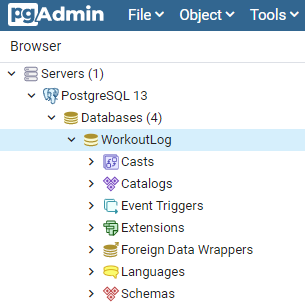
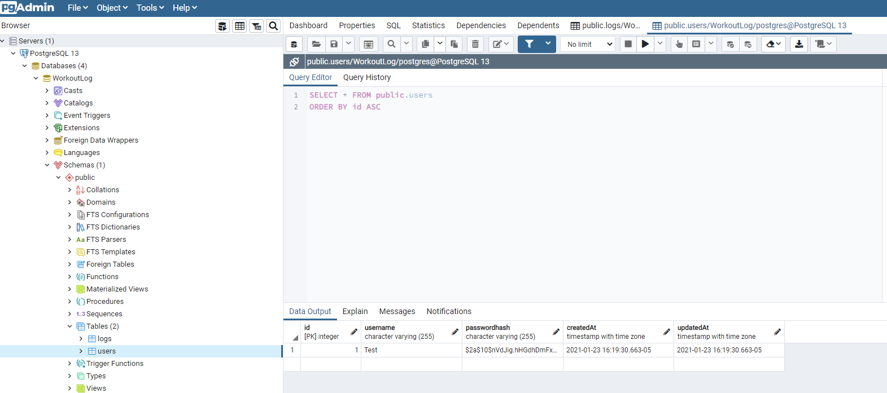
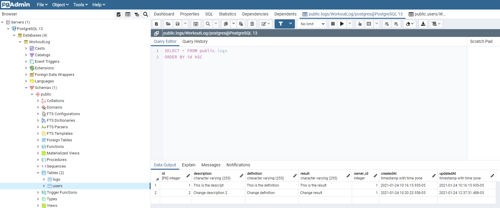
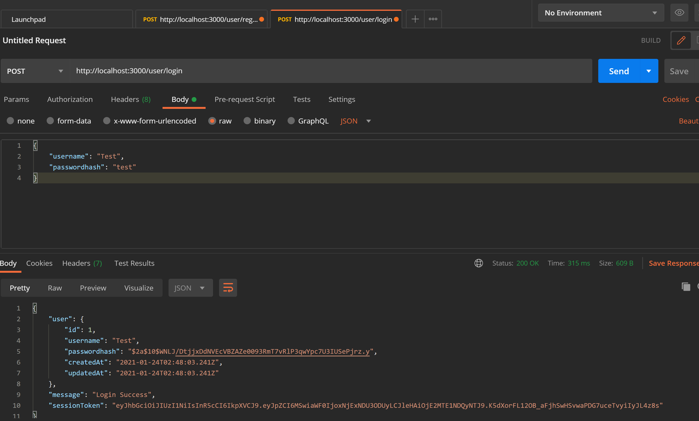
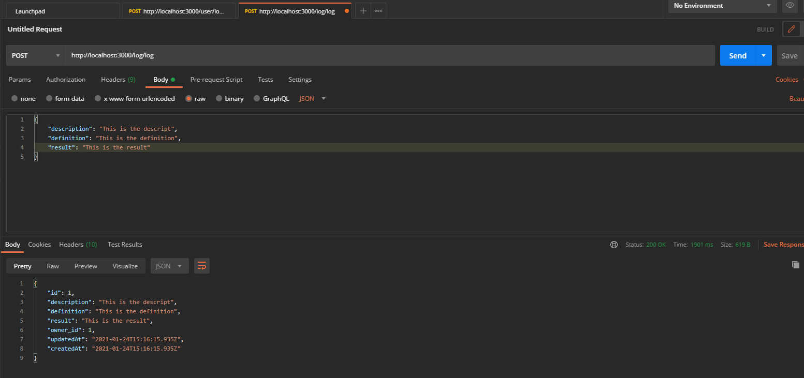
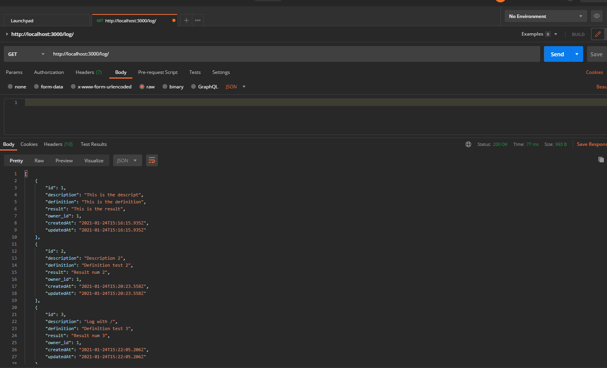
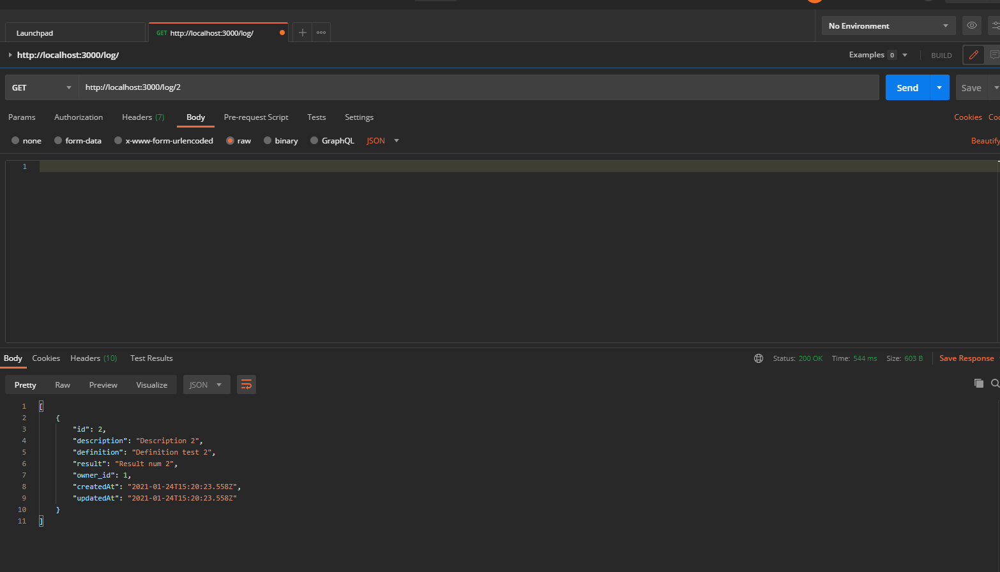
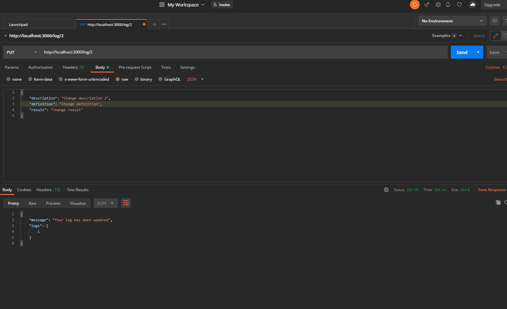
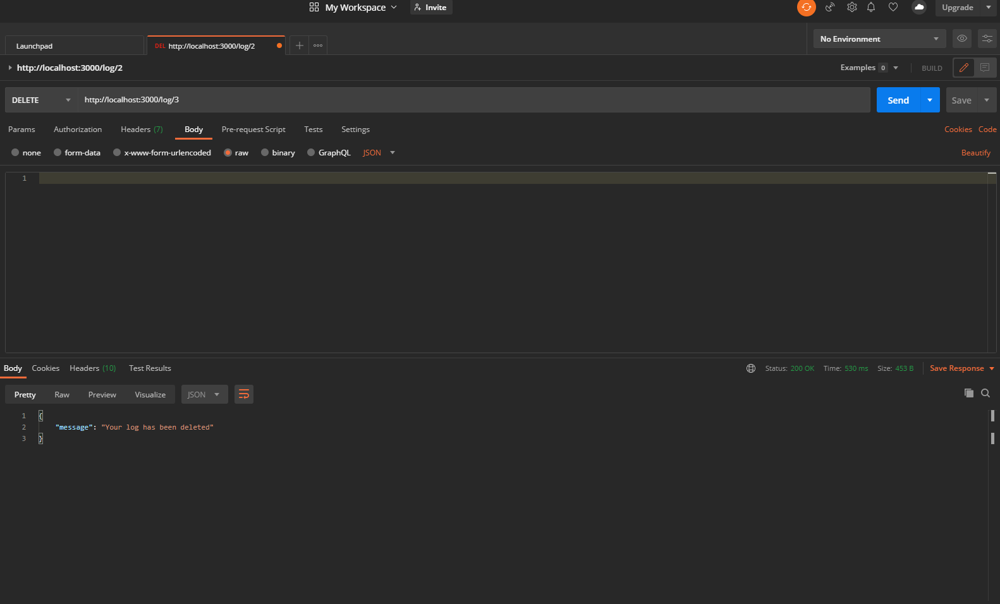

# Introduction

<h3>This is an Eleven Fifty Blue Badge project to test my ability to create a workout log app from scratch. Below are picture captures from Postman to prove that the app does function.<h3>

## `pgAdmin Images`

 
 

<h3>The server name<h3>

 
 

<h3>Created users<h3>

 
 

<h3>Created logs<h3>

 
 

## `Postman Images`

 
 

<h3>User creation success<h3>

 
 

<h3>User login success<h3>

 
 

<h3>User log creation success<h3>

 
 

<h3>Log search success<h3>

 
 

<h3>Log search by ID success<h3>

 
 

<h3>Log update success<h3>

 
 

<h3>Log deletion success<h3>
